> **Local reference** — ingested 2026-06-24 from Science Buddies.
> Source: <https://www.sciencebuddies.org/science-fair-projects/references/how-to-use-a-breadboard>
> Text via Defuddle + markdownify; diagrams downloaded to `assets/`. Tutorial © Science Buddies (clipped for personal project reference).

# How to Use a Breadboard for Electronics and Circuits

Many electronics projects use something called a **breadboard**. What is a breadboard, and how do you use it? This tutorial video will give you a basic introduction to breadboards and explain how to use them in beginner electronics projects; you can also read more details and see more examples in the text sections.

/-/https/i.ytimg.com/vi/MtiJz7gh1VU/maxresdefault.jpg)

<https://www.youtube.com/watch?v=MtiJz7gh1VU>

## More About Breadboards

* [Introduction](#introduction)
  + [What is a breadboard?](#what-breadboard)
  + [Where does the name "breadboard" come from?](#name-breadboard)
  + [Are there different kinds of breadboards?](#kinds-breadboard)
  + [What is a "solderless" breadboard?](#solderless-breadboard)
  + [Which electronic parts are compatible with breadboards?](#electronic-breadboard)
  + [Do I need any tools to use a breadboard?](#tools-breadboard)
* [What is inside a breadboard? How do they work?](#inside-breadboard)
* [Breadboard labels: rows, columns, and buses](#breadboard-labels)
  + [What do the letters and numbers on a breadboard mean?](#letters)
  + [What do the colored lines and plus and minus signs mean?](#lines)
  + [How are the holes connected?](#holes)
  + [Are all breadboards labeled the same way?](#labeled)
* [Using a breadboard](#using-breadboard)
  + [What is a breadboard diagram?](#breadboard-diagram)
  + [Does my circuit have to match the breadboard diagram exactly?](#circuit-match)
  + [What are jumper wires and what kind should I use?](#jumper-wires)
  + [Should I color-code my circuit?](#color-code)
  + [How do I build my circuit?](#build-circuit)
  + [How do I test my circuit?](#test-circuit)
* [Common mistakes and troubleshooting](#common-mistakes)
  + [Getting row numbers wrong](#row-numbers)
  + [Getting power and ground mixed up](#power)
  + [Not pushing leads and wires in all the way](#pushing)
  + [Putting components in backwards](#backwards)
  + [Short circuits](#short-circuits)
  + [Can breadboards break?](#breadboards-break)
* [Advanced notes](#advanced-notes)
  + [Integrated circuits (IC)](#integrated-circuits)
  + [Circuit diagrams](#circuit-diagrams)
  + [Through-hole vs. surface mount parts](#pth-smd)

---

## Introduction

### What is a breadboard?

A breadboard is a rectangular plastic board with a bunch of tiny holes in it. These holes let you easily insert electronic components to **prototype** (meaning to build and test an early version of) an electronic circuit, like this one with a battery, switch, resistor, and an LED (light-emitting diode). To learn more about individual electronic components, see our
[Electronics Primer](/science-fair-projects/references/electronics-primer-introduction).

/-/https/www.sciencebuddies.org/cdn/Files/7300/7/basic-LED-circuit.jpg)

The connections are not permanent, so it is easy to *remove* a component if you make a mistake, or just start over and do a new project. This makes breadboards great for beginners who are new to electronics. You can use breadboards to make all sorts of fun electronics projects, from different types of robots or an electronic drum set, to an electronic rain detector to help conserve water in a garden, just to name a few.

/-/https/www.sciencebuddies.org/cdn/Files/6991/6/rain-detector-prototype.jpg)Image Credit: [Ben Finio, Science Buddies / Science Buddies](/image-credit?id=6991) 
/-/https/www.sciencebuddies.org/cdn/Files/6435/17/light-tracking-bristlebot.jpg)Image Credit: [Ben Finio, Science Buddies / Science Buddies](/image-credit?id=6435)
/-/https/www.sciencebuddies.org/cdn/Files/6858/10/electronic-drumset.jpg)Image Credit: [Ben Finio, Science Buddies / Science Buddies](/image-credit?id=6858) 
/-/https/www.sciencebuddies.org/cdn/Files/6309/18/line-following-robot.jpg)Image Credit: [Ben Finio, Science Buddies / Science Buddies](/image-credit?id=6309)

### Where does the name "breadboard" come from?

You might be wondering what any of this has to do with bread. The term *breadboard* comes from the early days of electronics, when people would literally drive nails or screws into wooden boards on which they cut bread in order to connect their circuits. Luckily, since you probably do not want to ruin all your cutting boards for the sake of an electronics project, today there are better options.

/-/https/www.sciencebuddies.org/cdn/Files/7301/7/wooden-breadboard.jpg)Image Credit: [Ben Finio, Science Buddies / Science Buddies](/image-credit?id=7301)

### Are there different kinds of breadboards?

Modern breadboards are made from plastic, and come in all shapes, sizes, and even different colors. While larger and smaller sizes are available, the most common sizes you will probably see are "full-size," "half-size," and "mini" breadboards. Most breadboards also come with tabs and notches on the sides that allow you to snap multiple boards together. However, a single half-sized breadboard is sufficient for many beginner-level projects.

/-/https/www.sciencebuddies.org/cdn/Files/7317/6/breadboard-sizes.jpg)Image Credit: [Ben Finio, Science Buddies / Science Buddies](/image-credit?id=7317)

### What is a "solderless" breadboard?

Technically, these breadboards are called **solderless** breadboards because they do not require soldering to make connections. **Soldering** (pronounced SAW-der-ing) is a method where electronic components are joined together by melting a special type of metal called **solder**. Electronic components can be soldered directly together, but more commonly they are soldered onto **printed circuit boards** (PCBs). PCBs are what you will see if you take the cover off many electronic devices, like a computer or cell phone. Frequently, engineers will use solderless breadboards to prototype and test a circuit before building the final, permanent design on a PCB. This image shows the same circuit (battery, switch, resistor, and LED) built three different ways: on a solderless breadboard (left), with the components soldered directly together (middle), and on a printed circuit board (right):

/-/https/www.sciencebuddies.org/cdn/Files/7302/6/battery-resistor-LED-circuit.jpg)Image Credit: [Ben Finio, Science Buddies / Science Buddies](/image-credit?id=7302)

Soldering is a great technique to learn if you are interested in electronics, but the connections are much more permanent and it requires purchasing some tools to get started. The rest of this tutorial will focus on solderless breadboards, but you can read our
[soldering tutorial](/science-fair-projects/references/how-to-solder)
to learn more about soldering.

### Which electronic parts are compatible with breadboards?

So, how do electronic components fit into a breadboard? Many electronic components have long metal legs called **leads** (pronounced "leeds"). Sometimes, shorter metal legs are referred to as **pins** instead. Almost all components with leads will work with a breadboard (to learn more about these components and which types work with a breadboard, see the
[Advanced](#pth-smd) section).

/-/https/www.sciencebuddies.org/cdn/Files/7303/6/electronic-component-leads.jpg)Image Credit: [Ben Finio, Science Buddies / Science Buddies](/image-credit?id=7303)

Breadboards are designed so you can push these leads into the holes. They will be held in place snugly enough that they will not fall out (even if you turn the breadboard upside-down), but lightly enough that you can easily pull on them to remove them.

/-/https/www.sciencebuddies.org/cdn/Files/7304/6/breadboard-hole-leads.jpg)Image Credit: [Ben Finio, Science Buddies / Science Buddies](/image-credit?id=7304)

### Do I need any tools to use a breadboard?

You do not need any special tools to use a solderless breadboard. However, many electronic components are very tiny, and you may find them difficult to handle. A pair of [miniature needle nose pliers](https://www.avantlink.com/click.php?tt=cl&mi=10609&pw=182414&ctc=how-to-use-a-breadboard&url=https%3a%2f%2fwww.jameco.com%2fwebapp%2fwcs%2fstores%2fservlet%2fStoreCatalogDrillDownView%3flangId%3d-1%26storeId%3d10001%26catalogId%3d10001%26freeText%3dneedle%2520nose%2520pliers%26search_type%3djamecoall) or [tweezers](https://www.avantlink.com/click.php?tt=cl&mi=10609&pw=182414&ctc=how-to-use-a-breadboard&url=https%3a%2f%2fwww.jameco.com%2fwebapp%2fwcs%2fstores%2fservlet%2fStoreCatalogDrillDownView%3flangId%3d-1%26storeId%3d10001%26catalogId%3d10001%26freeText%3dtweezers%26search_type%3djamecoall) may make it easier to pick up small components.

## What is inside a breadboard?

The leads can fit into the breadboard because the *inside* of a breadboard is made up of rows of tiny metal clips. This is what the clips look like when they are removed from a breadboard.

/-/https/www.sciencebuddies.org/cdn/Files/7318/7/breadboard-clips.jpg)Image Credit: [Ben Finio, Science Buddies / Science Buddies](/image-credit?id=7318)

When you press a component's lead into a breadboard hole, one of these clips grabs onto it.

/-/https/www.sciencebuddies.org/cdn/Files/7319/7/breadboard-component-clip.jpg)Image Credit: [Ben Finio, Science Buddies / Science Buddies](/image-credit?id=7319)

Some breadboards are actually made of transparent plastic, so you can see the clips inside.

/-/https/www.sciencebuddies.org/cdn/Files/7320/6/transparent-breadboard-clips.jpg)Image Credit: [Ben Finio, Science Buddies / Science Buddies](/image-credit?id=7320)

Most breadboards have a backing layer that prevents the metal clips from falling out. The backing is typically a layer of sticky, double-sided tape covered by a protective layer of paper. If you want to permanently "stick" the breadboard to something (for example, a robot), you just need to peel off the paper layer to expose the sticky tape underneath. In this picture, the breadboard on the right has had its backing removed completely (so you can see all the metal clips). The breadboard on the left still has its sticky backing, with one corner of the paper layer peeled up.

/-/https/www.sciencebuddies.org/cdn/Files/7321/7/breadboard-backing.jpg)Image Credit: [Ben Finio, Science Buddies / Science Buddies](/image-credit?id=7321)

## Breadboard labels: rows, columns, and buses

### What do the letters and numbers on a breadboard mean?

Most breadboards have some numbers, letters, and plus and minus signs written on them. What does all that mean? While their exact appearance might vary from breadboard to breadboard, the general purpose is always the same. These labels help you locate certain holes on the breadboard so you can follow directions when building a circuit. If you have ever used a spreadsheet program like Microsoft Excel® or Google Sheets™, the concept is exactly the same. Row numbers and column letters help you identify individual holes in the breadboard, just like cells in a spreadsheet. For example, all of the highlighted holes are in "column C."

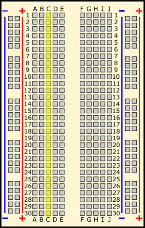Image Credit: [Ben Finio, Science Buddies / Science Buddies](/image-credit?id=7322)

All of the highlighted holes are in "row 12."

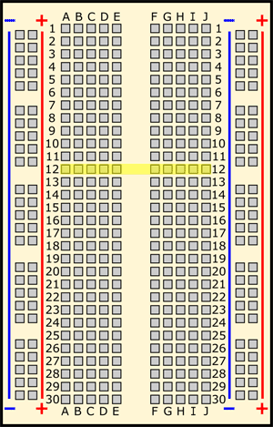Image Credit: [Ben Finio, Science Buddies / Science Buddies](/image-credit?id=7323)

"Hole C12" is where column C intersects row 12.

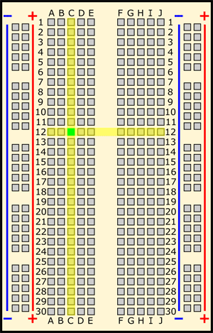Image Credit: [Ben Finio, Science Buddies / Science Buddies](/image-credit?id=7324)

### What do the colored lines and plus and minus signs mean?

What about the long strips on the side of the breadboard, highlighted in yellow here?

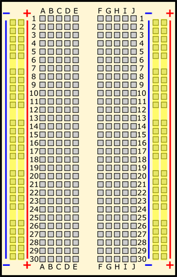Image Credit: [Ben Finio, Science Buddies / Science Buddies](/image-credit?id=7325)

These strips are typically marked by red and blue (or red and black) lines, with plus (+) and minus (-) signs, respectively. They are called the **buses**, also referred to as **rails**, and are typically used to supply electrical power to your circuit when you connect them to a battery pack or other external power supply. You may hear the buses referred to by different names; for example, *power bus*, *positive bus*, and *voltage bus* all refer to the one next to the red line with the plus (+) sign. Similarly, *negative bus* and *ground bus* both refer to one next to the blue (or black) line with the minus (-) sign. Sound confusing? Use this table to help you remember—there are different ways to refer to the buses, but they all mean the same thing. Do not worry if you see them referred to by different names in different places (for example, in different Science Buddies projects or other places on the internet). Sometimes you might hear "power buses" (or rails) used to refer to *both* of the buses (or rails) together, not just the positive one.

| Positive | Negative |
| --- | --- |
| Power | Ground |
| Plus sign (+) | Minus sign (-) |
| Red | Blue or black |

Note that there is no physical difference between the positive and negative buses, and using them is not a requirement. The labels just make it easier to organize your circuit, similar to [color-coding your wires](#color-code).

### How are the holes connected?

Remember that the inside of the breadboard is made up of sets of five metal clips. This means that each set of five holes forming a half-row (columns A–E or columns F–J) is electrically connected. For example, that means hole A1 is electrically connected to holes B1, C1, D1, and E1. It is *not* connected to hole A2, because that hole is in a different row, with a separate set of metal clips. It is also *not* connected to holes F1, G1, H1, I1, or J1, because they are on the other "half" of the breadboard—the clips are not connected across the gap in the middle (to learn about the gap in the middle of the breadboard, see the [Advanced](#integrated-circuits) section). Unlike all the main breadboard rows, which are connected in sets of five holes, the buses typically run the entire length of the breadboard (but there are some exceptions). This image shows which holes are electrically connected in a typical half-sized breadboard, highlighted in yellow lines.

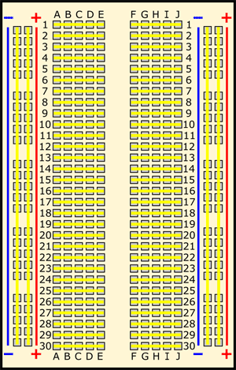Image Credit: [Ben Finio, Science Buddies / Science Buddies](/image-credit?id=7326)

Buses on opposite sides of the breadboard are *not* connected to each other. Typically, to make power and ground available on both sides of the breadboard, you would connect the buses with jumper wires, like this. Make sure to connect positive to positive and negative to negative (see the section on [buses](#lines) if you need a reminder about which color is which).

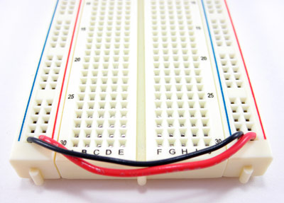Image Credit: [Ben Finio, Science Buddies / Science Buddies](/image-credit?id=7327)

### Are all breadboards labeled the same way?

Note that exact configurations might vary from breadboard to breadboard. For example, some breadboards have the labels printed in "landscape" orientation instead of "portrait" orientation. Some breadboards have the buses broken in half along the length of the breadboard (useful if you need to supply your circuit with two different voltage levels). Most "mini" breadboards do not have buses or labels printed on them at all.

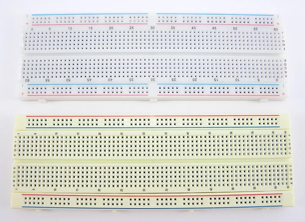Image Credit: [Ben Finio, Science Buddies / Science Buddies](/image-credit?id=7328)

There may be small differences in how the buses are labeled from breadboard to breadboard. Some breadboards only have the colored lines and no plus (+) or minus (-) signs. Some breadboards have the positive buses on the left and the negative buses on the right, and on other breadboards, this is reversed. Regardless of how they are labeled and the left⁄right positions, the function of the buses remains the same.

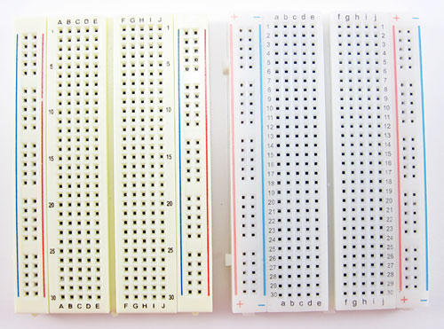Image Credit: [Ben Finio, Science Buddies / Science Buddies](/image-credit?id=7329)

## Using a breadboard

### What is a breadboard diagram?

A **breadboard diagram** is a computer-generated drawing of a circuit on a breadboard. Unlike a **circuit diagram** or a **schematic** (which use symbols to represent electronic components; see the [Advanced](#circuit-diagrams) section to learn more), breadboard diagrams make it easy for beginners to follow instructions to build a circuit because they are designed to look like the "real thing." For example, this diagram (made with a free program called [Fritzing](https://fritzing.org/home/)) shows a basic circuit with a battery pack, an LED, a resistor, and a pushbutton, which looks very similar to the physical circuit:

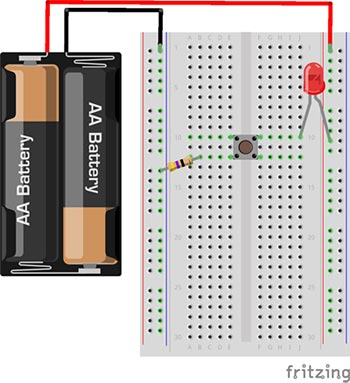Image Credit: [Ben Finio, Science Buddies / Science Buddies](/image-credit?id=7330) 
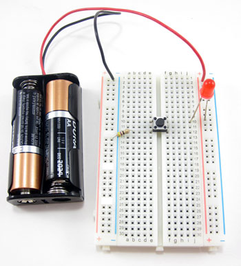Image Credit: [Ben Finio, Science Buddies / Science Buddies](/image-credit?id=7331)

Sometimes, breadboard diagrams might be accompanied by (or replaced with) written directions that tell you where to put each component on the breadboard. For example, the directions for this circuit might say:

1. Connect the battery pack's red lead to the power bus.
2. Connect the battery pack's black lead to the ground bus.
3. Connect the resistor from hole B12 to the ground bus.
4. Insert the pushbutton's four pins into holes E10, F10, E12, and F12.
5. Insert the LED's long lead into the power bus, and the short lead into hole J10.

This information can also be formatted as a table:

| Component | Picture | Symbol | Location |
| --- | --- | --- | --- |
| Battery pack | A battery pack that can hold two double A batteriesImage Credit: [Ben Finio, Science Buddies / Science Buddies](/image-credit?id=7358) | Breadboard diagram symbol for a battery pack that can hold two double A batteries[Image Credit](/image-credit?id=7359) | Red lead to (+) bus  Black lead to (-) bus |
| LED | A red LEDImage Credit: [Ben Finio, Science Buddies / Science Buddies](/image-credit?id=7360) | Breadboard diagram symbol for a red LEDImage Credit: [Ben Finio, Science Buddies / Science Buddies](/image-credit?id=7361) | Long lead to (+) bus  Short lead to J10 |
| Pushbutton | A pushbutton switch[Image Credit](/image-credit?id=7362) | Breadboard diagram symbol for a pushbutton switch[Image Credit](/image-credit?id=7363) | Holes E10, F10, E12, F12 |
| Resistor | A 47 ohm resistorImage Credit: [Ben Finio, Science Buddies / Science Buddies](/image-credit?id=7364) | Breadboard diagram symbol for a 47 ohm resistor[Image Credit](/image-credit?id=7365) | Hole B12 to (-) bus |

### Does my circuit have to match the breadboard diagram exactly?

The short answer is "no." However, when you are first starting out using breadboards, it is probably best to follow the breadboard diagrams exactly.

To understand this, it helps to understand [how a breadboard's holes are electrically connected](#holes). There are different ways to change the *physical* layout of a circuit on a breadboard without actually changing the *electrical* connections. For example, these two circuits are electrically identical; even though the leads of the LED have moved, there is still a complete path (called a **closed circuit**) for electricity to flow through the LED (highlighted with yellow arrows). So, even if the directions say "put the LED's long lead in hole F10," the circuit will still work if you put it in hole H10 instead (but *not* if you put it in hole F9 or F11, because different rows are not connected).

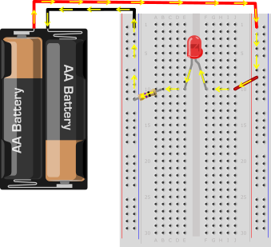Image Credit: [Ben Finio, Science Buddies / Science Buddies](/image-credit?id=7332) 
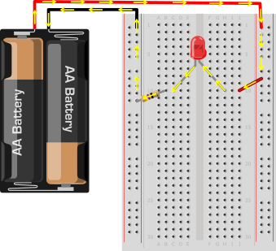Image Credit: [Ben Finio, Science Buddies / Science Buddies](/image-credit?id=7333)

However, you can also completely rearrange the components on the breadboard. As long as the circuit is *electrically* equivalent, it will still work. Even though this circuit "looks different" than the previous two because the components have been rearranged, electricity still follows an equivalent path through the LED and the resistor.

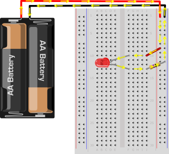Image Credit: [Ben Finio, Science Buddies / Science Buddies](/image-credit?id=7334)

### What are jumper wires and what kind should I use?

Jumper wires are wires that are used to make connections on a breadboard. They have stiff ends that are easy to push into the breadboard holes. There are several different options available when purchasing jumper wires.

[Flexible jumper wires](https://www.avantlink.com/click.php?tt=cl&mi=10609&pw=182414&ctc=how-to-use-a-breadboard&url=https%3a%2f%2fwww.jameco.com%2fwebapp%2fwcs%2fstores%2fservlet%2fProduct_10001_10001_2150467_-1) are made of a flexible wire with a rigid pin attached to both ends. These wires usually come in packs of varying colors. This makes it easy to color-code your circuit (see the section on [color-coding](#color-code)). While these wires are easy to use for beginner circuits, they can get very messy for more complicated circuits; because they are so long, you will wind up with a tangled nest of wires that are hard to trace (sometimes called a "rat's nest" or "spaghetti").

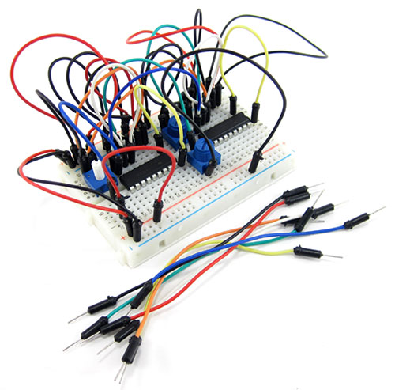Image Credit: [Ben Finio, Science Buddies / Science Buddies](/image-credit?id=7335)

Jumper wire kits are packs of pre-cut lengths of wire that have their ends bent down 90 degrees, so they are ready to put into a breadboard. The kits are available in [larger](https://www.avantlink.com/click.php?tt=cl&mi=10609&pw=182414&ctc=how-to-use-a-breadboard&url=https%3a%2f%2fwww.jameco.com%2fwebapp%2fwcs%2fstores%2fservlet%2fProduct_10001_10001_19290_-1) and [smaller](https://www.avantlink.com/click.php?tt=cl&mi=10609&pw=182414&ctc=how-to-use-a-breadboard&url=https%3a%2f%2fwww.jameco.com%2fwebapp%2fwcs%2fstores%2fservlet%2fProduct_10001_10001_2127718_-1) sizes. These kits are very convenient because they come with wires of many different pre-cut lengths. The disadvantage is that there is typically only one length of each color. This can make it difficult to color-code your circuit (for example, you might want a long black wire, but your kit might only have short black wires). Your circuit will still work just fine, but color-coding can help you stay more organized (again, see the section on [color-coding](#color-code) for more information). Notice how this circuit looks much less messy than the previous one, since the wires are shorter.

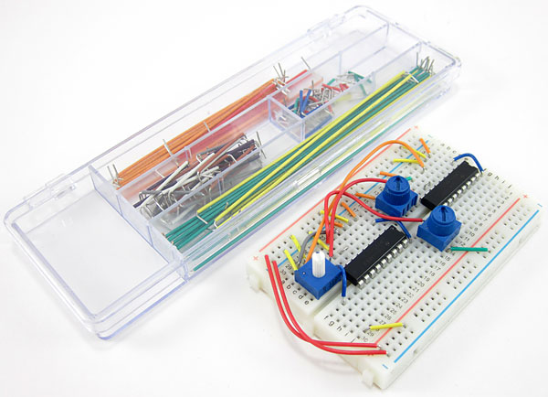Image Credit: [Ben Finio, Science Buddies / Science Buddies](/image-credit?id=7336)

Finally, you can also buy spools of [solid-core hookup wire](https://www.avantlink.com/click.php?tt=cl&mi=10609&pw=182414&ctc=how-to-use-a-breadboard&url=https%3a%2f%2fwww.jameco.com%2fwebapp%2fwcs%2fstores%2fservlet%2fStoreCatalogDrillDownView%3flangId%3d-1%26storeId%3d10001%26catalogId%3d10001%26freeText%3dsolid%2520hookup%2520wire%26search_type%3djamecoall) and a pair of [wire strippers](https://www.avantlink.com/click.php?tt=cl&mi=10609&pw=182414&ctc=how-to-use-a-breadboard&url=https%3a%2f%2fwww.jameco.com%2fwebapp%2fwcs%2fstores%2fservlet%2fStoreCatalogDrillDownView%3flangId%3d-1%26storeId%3d10001%26catalogId%3d10001%26freeText%3dwire%2520strippers%26search_type%3djamecoall) and cut your own jumper wires. This is the best long-term option if you plan on doing lots of electronics projects, because you can cut wires to the exact length you need, and pick which colors you want. It is also much more cost-effective per length of wire. Buying a [kit of six different colors](https://www.avantlink.com/click.php?tt=cl&mi=10609&pw=182414&ctc=how-to-use-a-breadboard&url=https%3a%2f%2fwww.jameco.com%2fwebapp%2fwcs%2fstores%2fservlet%2fProduct_10001_10001_2153705_-1) is a good place to start. It is important to buy **solid core** wire (which is made from a single, solid piece of metal) and not **stranded** wire (which is made from multiple, smaller strands of wire, like a rope). Stranded wire is much more flexible, so it is very hard to push into a breadboard's holes. You also need to purchase the right **wire gauge**, which is a way of measuring wire diameter. 22 AWG (American Wire Gauge) is the most common gauge used for breadboards. To learn more about wire gauge and how to strip wire, see the Science Buddies [Wire Stripping Tutorial](/science-fair-projects/references/wire-stripping-tutorial). Notice how in this circuit, red and black are used for all the connections to the buses (see the section on [color-coding](#color-code) to learn more).

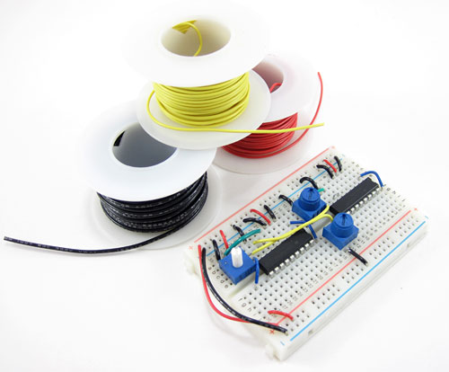Image Credit: [Ben Finio, Science Buddies / Science Buddies](/image-credit?id=7337)

### Should I color-code my circuit?

Whether or not you color-code your circuit depends largely on what type of jumper wire you purchase (see the question about [jumper wires](#jumper-wires)). Color-coding is a matter of convenience in that it can help you stay more organized, but using different color wires will not change how your circuit works. **Important**: This statement only applies to **jumper wires**. Some circuit components, like battery packs and certain sensors, come with colored wires already attached to them. Keeping track of these colors *does* matter (for example, do not get the red and black leads on a battery pack mixed up). All jumper wires, however, are just metal on the inside with colored plastic insulation on the outside. The color of the plastic does not affect how electricity flows through the wire.

In electronics, it is generally standard to use red wire for positive (+) connections and black wire for negative (-) connections. What other colors you use is largely a matter of choice and will depend on the specific circuit you are building. For example, there are a few different ways you could wire this circuit with red, green, blue, and yellow LEDs, but they will all work exactly the same:

* If you purchased a pre-cut jumper wire kit, use whatever wire colors are available at the appropriate lengths (left image).
* Use red and black wires for the positive and negative sides of each LED, respectively (center image).
* Only use red and black wires for the bus connections, and use red, green, blue, and yellow wire for the respective LEDs (right image).

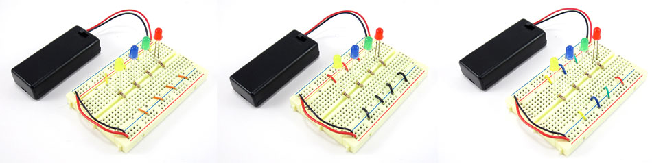Image Credit: [Ben Finio, Science Buddies / Science Buddies](/image-credit?id=7338)

Remember the important part: *the color of the wires does not affect how the circuit works!* The three circuits in this image will all work exactly the same (the LEDs will light up when the battery pack is turned on) even though they have different color wires. If a breadboard diagram shows a blue wire and you use an orange wire instead, nothing will be wrong with your circuit.

### How do I build a circuit?

To build a circuit:

* Follow the [breadboard diagram](#breadboard-diagram) for the circuit, connecting one component at a time.
* Always connect the batteries or power supply to your circuit *last*. This will give you a chance to double-check all your connections before you turn your circuit on for the first time.
* Keep an eye out for [common mistakes](#common-mistakes) that many beginners make when using a breadboard.

### How do I test my circuit?

How you test your circuit will depend on the specific circuit you are building. In general, you should follow this procedure:

* Double-check your circuit and the breadboard diagram to make sure all your components are in the right place.
* Check what your circuit is supposed to do according to the project directions. Is it supposed to flash lights, make noise, somehow respond to a sensor (like a motion or light sensor), or make a robot move? Many Science Buddies projects will contain a written description and/or video of how your circuit should work.
* Turn the power to your circuit on (for example, by sliding a battery pack switch from OFF to ON). If you see or smell smoke, turn off or disconnect the power supply *immediately*. This means you have a [short circuit](#short-circuits).
* Follow the project directions to use your circuit (for example, shining a flashlight at a light-tracking robot, or waving your hand in front of a motion sensor).
* If your circuit does not work, you need to troubleshoot (or **debug**, meaning to look for problems or "bugs" in your circuit). See the [common mistakes](#common-mistakes) section for things you should check.

## Common mistakes and troubleshooting

### Getting row numbers wrong

Can you spot the difference between these two circuits?

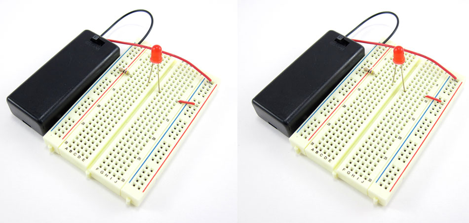Image Credit: [Ben Finio, Science Buddies / Science Buddies](/image-credit?id=7339)

At first glance, they might look exactly the same. However, when we turn the battery packs on, only the LED on the left lights up. What is wrong?

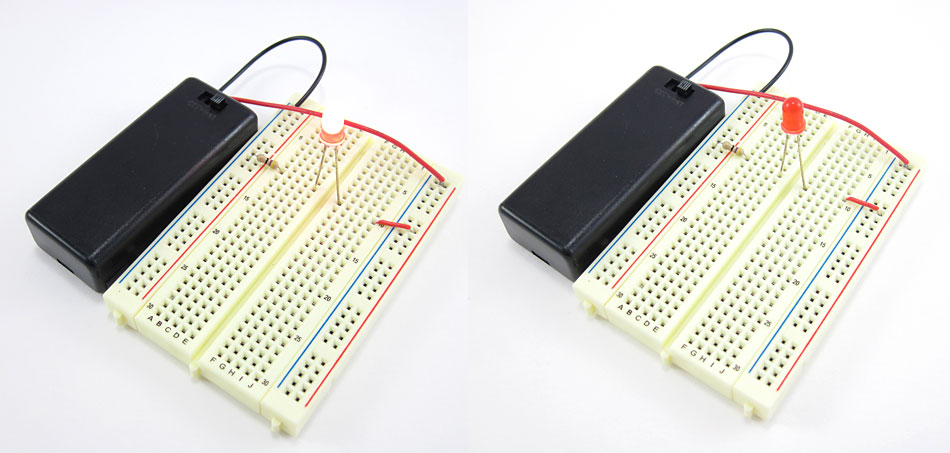Image Credit: [Ben Finio, Science Buddies / Science Buddies](/image-credit?id=7340)

Let us take a look at the breadboard diagram for the circuit to see if we can spot the problem. The circuit should match this diagram:

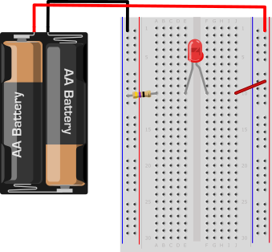Image Credit: [Ben Finio, Science Buddies / Science Buddies](/image-credit?id=7343)

Now, let us take a closer look at the two circuits. Carefully compare the two pictures to the breadboard diagram. Can you spot what is wrong? If you still cannot tell, click on the image to reveal the problem.

Do you see the problem yet? In the circuit on the left, the red jumper wire goes from the positive bus to hole J10, which matches the breadboard diagram. In the circuit on the right, it goes from the positive bus to hole *J9*. Remember from the section on [how the holes are connected](#holes) that holes in different rows are not electrically connected to each other. So, with the jumper wire in row 9 and the LED in row 10, there is no way for electricity to flow to the LED.

It can be difficult to spot such a tiny error! However, it only takes one misplaced wire or component lead to stop a circuit from working completely. This is why you should always carefully check and double-check your wiring before you test a circuit. If your circuit is not working, carefully double-check all your connections and make sure to count the row numbers.

### Getting power and ground mixed up

Similar to getting row numbers wrong, getting the power and ground buses mixed up is another common mistake. Can you spot the difference between these two circuits? Only the LED on the left lights up.

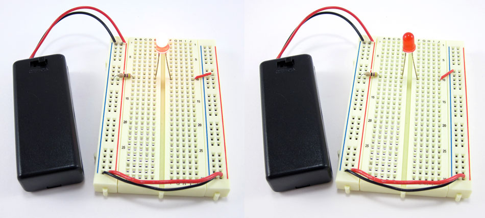Image Credit: [Ben Finio, Science Buddies / Science Buddies](/image-credit?id=7341)

Let us take a closer look at the circuits. Can you spot what is wrong? Click on the image to reveal the problem.

Do you see the problem yet? In the photo on the left, the red jumper wire goes to the positive (+) bus. In the photo on the right, it goes to the negative (-) bus. According to the breadboard diagram from the [previous section](#row-numbers), it should go to the positive (+) bus. Remember that "positive" and "negative" can also be referred to as "power" and "ground." See the section on [buses](#lines) if you need a reminder.

How about the difference between these two circuits? Again, only the LED on the left lights up.

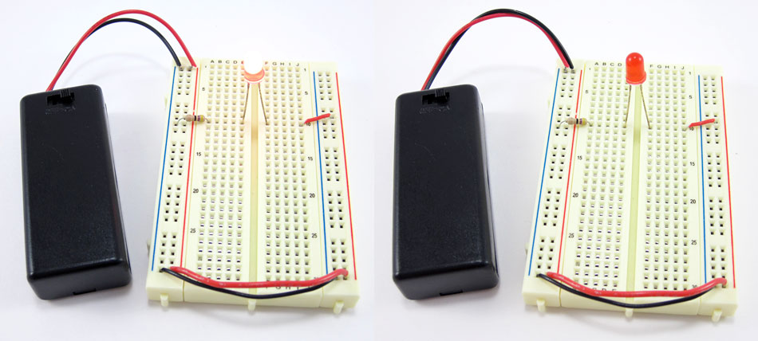Image Credit: [Ben Finio, Science Buddies / Science Buddies](/image-credit?id=7342)

Take a closer look to see if you can spot the problem (click on the image to reveal it).

This time, the battery pack leads are reversed. The red lead is connected to the negative (-) bus and the black lead is connected to the positive (+) bus. Remember that unlike with [jumper wires](#jumper-wires), the colors of battery pack leads *do* matter. Red is used for positive and black is used for negative.

Finally, remember on some breadboards the positive bus is on the left and the negative bus is on the right. On other breadboards this is reversed. Be careful when you switch between breadboards since the left-right positions of the buses may change.

Image Credit: [Ben Finio, Science Buddies / Science Buddies](/image-credit?id=7329)

### Not pushing leads and wires in all the way

Electronic components and jumper wires can all have leads of varying lengths. Sometimes students will only push leads *partially* into a breadboard hole, instead of pushing them down firmly all the way (until they cannot go any farther). This can result in loose connections that lead to strange circuit behavior, like an LED flickering on and off. Take a look at these two side-by-side images. The image on the left shows leads that have not been pushed into the breadboard all the way. The picture on the right shows leads that are properly pushed into the breadboard as far as they can go.

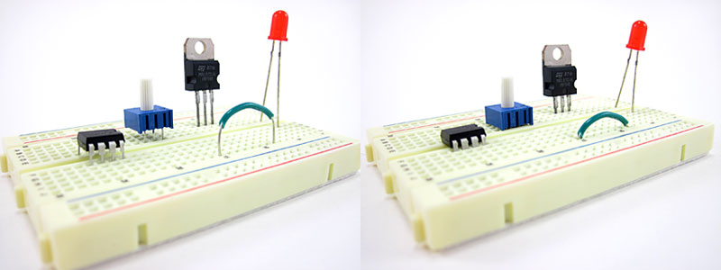

Note that some components, like LEDs, have very long leads that do not fit into the breadboard all the way. Other components, like pre-cut jumper wires, typically have leads cut to the right length, so they fit flush up against the breadboard.

### Putting components in backwards

For some electronic components, *direction matters*. Some components have **polarity**, meaning they have a positive side and a negative side that must be connected correctly. Other components have multiple pins that all serve different functions. Putting these components into your circuit backwards or facing the wrong way will prevent your circuit from functioning properly. If your circuit is not working and it involves any of these components, check to make sure they are inserted the right way.

**Batteries** have a positive terminal and a negative terminal. There are many different types of batteries, but the positive terminal is almost always marked with a "+" symbol. Typically, battery holders will have "+" and "-" symbols printed inside them; make sure the "+" symbols on your batteries line up with the "+" symbols in the battery holder.

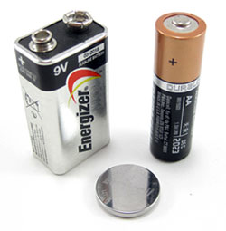Image Credit: [Ben Finio, Science Buddies / Science Buddies](/image-credit?id=7345)

**LEDs** have a positive side (called the **anode**) and a negative side (called the **cathode**). The metal lead for the anode is longer than the lead for the cathode. The cathode side also usually has a flat edge on the plastic part of the LED.

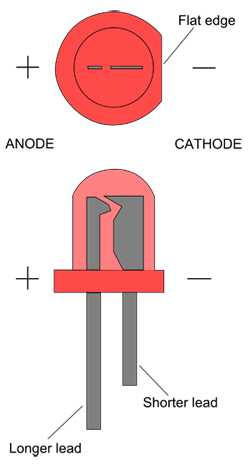Image Credit: [Ben Finio, Science Buddies / Science Buddies](/image-credit?id=7356)

**Diodes** are like one-way valves that only let electricity flow in one direction. They are usually small cylinders marked with a band or stripe on one end (this is the direction electricity can flow toward).

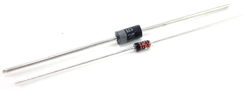Image Credit: [Ben Finio, Science Buddies / Science Buddies](/image-credit?id=7346)

**Capacitors** are components that can store electrical charge. Common "ceramic disc" capacitors (small orange/tan circles) are not polarized, but several other types of capacitors are, and will typically have arrow or minus signs pointing toward the negative lead.

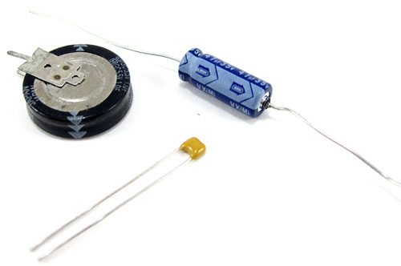Image Credit: [Ben Finio, Science Buddies / Science Buddies](/image-credit?id=7347)

**Transistors** are like electronically controlled switches that can be used to turn things like motors and lights on and off. Transistors generally have three pins. Putting a transistor in a breadboard backwards will reverse the order of the pins and prevent it from working. Transistors come in several different "packages," usually a black plastic body with small writing on one side.

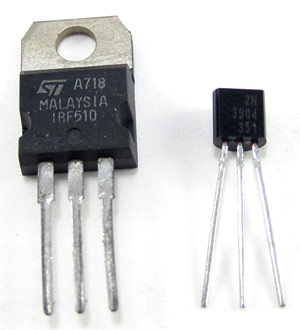Image Credit: [Ben Finio, Science Buddies / Science Buddies](/image-credit?id=7357)

**Integrated circuits**, or **ICs** for short (sometimes also called "chips") are black rectangular pieces with two rows of pins. They typically have a notch or hole at one end that tells you which way is "up," so you do not put the IC in the breadboard upside-down. See the advanced section on [integrated circuits](#integrated-circuits) to learn more.

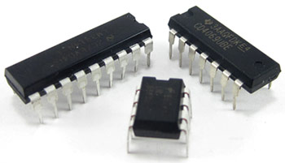Image Credit: [Ben Finio, Science Buddies / Science Buddies](/image-credit?id=7348)

Directions on the Science Buddies website will almost always specify which way a component should be facing; for example, "make sure the gray stripe on the diode is facing toward the positive bus" or "make sure the writing on the transistor is facing to the left." However, some advanced electronics projects may assume you know how to connect certain components properly.

For some electronic components, direction does *not* matter. For example, **jumper wires** and **resistors** work the same in both directions. Look closely at these two images. Even though the jumper wire and resistor have been flipped around in the picture on the right (the jumper wire has a black mark on one end so you can tell which end is which, and the resistor has colored bands), the LED still lights up. Electrically, nothing has changed in the circuit.

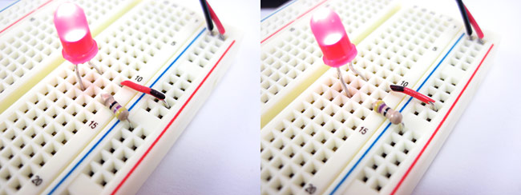Image Credit: [Ben Finio, Science Buddies / Science Buddies](/image-credit?id=7349)

### Short circuits

**Short circuits** occur when "accidental" connections are made on a breadboard between two components that are not supposed to be connected. This can happen from putting components into the wrong rows or buses, or from letting exposed metal parts bump into each other. For example, resistors and LEDs have long metal leads; if you are not careful, these leads could bump into each other and cause a short circuit. If your circuit has components with long, exposed leads, always make sure the leads are not touching each other.

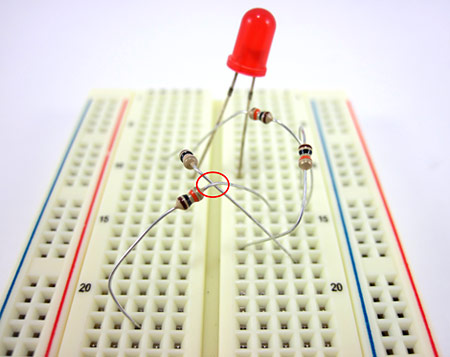Image Credit: [Ben Finio, Science Buddies / Science Buddies](/image-credit?id=7350)

Depending on the circuit, sometimes short circuits are harmless. They may just prevent the circuit from functioning properly until they are located and fixed. However, sometimes short circuits can "burn out" components and cause permanent damage. Short circuits between the power and ground buses are especially important to avoid, because they can get hot enough to burn you and even melt the plastic on the breadboard! In this picture, the red and black wires from a 4xAA battery pack have both been inserted into the ground bus, instead of one into the ground bus and one into the power bus. This causes the breadboard and wire insulation to start melting.

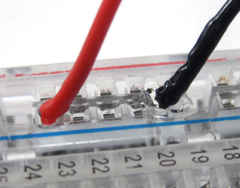Image Credit: [Ben Finio, Science Buddies / Science Buddies](/image-credit?id=7351)

If you ever see or smell smoke when building a circuit, you probably have a short circuit. You should immediately disconnect the battery pack.

### Can breadboards break?

While it is uncommon for breadboards to break, especially if they are brand new, the metal clips inside them can fatigue over time with heavy use. This can cause poor or intermittent connections with parts inserted into the breadboard. If you have exhausted all other troubleshooting options and still cannot figure out what is wrong with your circuit, you can try rebuilding it on a different breadboard. If you have a multimeter available, you can also try to locate bad connections in the breadboard, as shown in this video:

<https://www.youtube.com/watch?v=Mfk3Qk3-LWU>

## Advanced

### Integrated circuits (ICs)

**Integrated circuits**, or ICs for short (sometimes just referred to as "chips") are specialized circuits that serve a huge variety of purposes, such as controlling a robot's motors or making LEDs respond to music. Many ICs come in something called a **dual in-line package**, or DIP, meaning they have two parallel rows of pins. The gap in the middle of a breadboard (between columns E and F) is just the right width for an IC to fit, straddling the gap, with one set of pins in column E, and one set of pins in column F. Projects that use ICs will always tell you to connect them to the breadboard in this manner.

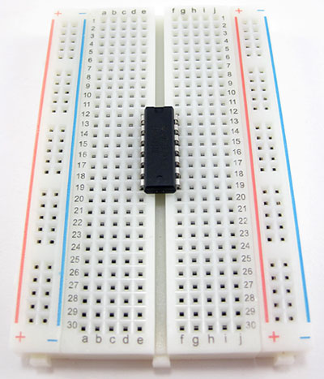Image Credit: [Ben Finio, Science Buddies / Science Buddies](/image-credit?id=7352)

### Circuit diagrams

**Circuit diagrams**, or **schematics**, are a way to represent a circuit using symbols for each component. Circuit diagrams, as opposed to [breadboard diagrams](#breadboard-diagram), are used by professional engineers when designing circuits, and they are much more convenient for more complicated circuits. You may be introduced to basic circuit diagrams in a high school physics class. For example, this circuit diagram shows a basic circuit with a battery, a switch, an LED, and a resistor.

Image Credit: [Ben Finio, Science Buddies / Science Buddies](/image-credit?id=7353)

However, unlike breadboard diagrams, circuit diagrams only show *electrical* connections between components. They do not necessarily correspond to the *physical* layout of the components on a breadboard. For example, even though it looks different, this circuit diagram is identical to the previous one.

Image Credit: [Ben Finio, Science Buddies / Science Buddies](/image-credit?id=7354)

If you have a hard time understanding this, try using your figure to trace the "wire" (the black line) through the circuit, starting at the top of the battery. Notice how your finger still goes through each component in the same order, even though they have been physically rearranged.

It takes some practice to learn how to read and interpret circuit diagrams. Most beginner electronics projects—especially those on the Science Buddies website—will provide breadboard diagrams that you can follow to build a circuit.

### Through-hole vs. surface mount parts

Breadboards are designed to work with **through-hole** electronic components. These components have long metal leads that are designed to be inserted through holes in a **printed circuit board** (PCB) that are plated with a thin copper coating, which allows the components' leads to be soldered to the board.

/-/https/www.sciencebuddies.org/cdn/Files/7303/6/electronic-component-leads.jpg)Image Credit: [Ben Finio, Science Buddies / Science Buddies](/image-credit?id=7303)

Breadboards do not work with **surface mount** components. These components have short, flat pins on their sides that are designed to be soldered to the surface of a printed circuit board, instead of through holes.

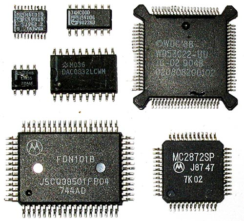Image Credit: [Ben Finio, Science Buddies / Science Buddies](/image-credit?id=7355)

Many electronic components are available in both through-hole and surface mount packages. For example, the [LM3914](https://www.avantlink.com/click.php?tt=cl&mi=10609&pw=182414&ctc=how-to-use-a-breadboard&url=https%3a%2f%2fwww.jameco.com%2fJameco%2fProducts%2fProdDS%2f300003.pdf) is an integrated circuit that is designed to drive 10 LEDs as a "bar graph" display. If you search [Jameco Electronics](https://www.avantlink.com/click.php?tt=cl&mi=10609&pw=182414&ctc=how-to-use-a-breadboard&url=http%3a%2f%2fwww.jameco.com%2fwebapp%2fwcs%2fstores%2fservlet%2fStoreCatalogDrillDownView%3flangId%3d-1%26storeId%3d10001%26catalogId%3d10001%26freeText%3dLM3914%26search_type%3djamecoall) for "LM3914", several different results come up. You can tell from looking at the thumbnails that [this part](https://www.avantlink.com/click.php?tt=cl&mi=10609&pw=182414&ctc=how-to-use-a-breadboard&url=http%3a%2f%2fwww.jameco.com%2fwebapp%2fwcs%2fstores%2fservlet%2fProduct_10001_10001_300003_-1) is through hole and [this part](https://www.avantlink.com/click.php?tt=cl&mi=10609&pw=182414&ctc=how-to-use-a-breadboard&url=https%3a%2f%2fwww.jameco.com%2fwebapp%2fwcs%2fstores%2fservlet%2fProduct_10001_10001_839851_-1) is surface mount. While most Science Buddies projects will link to exactly what parts you need to buy for a project, be careful if you are buying parts for your own project. If you are using a breadboard, make sure you buy through-hole parts and not surface mount.

**Please Give Us Feedback!**
**Thank you! Please tell us a little bit more about your experience.**

|  |  |
| --- | --- |
| Please rate the overall quality of this project guide.   Excellent           Very Good           Good           OK           Poor  $(function () { sb.feedback.init($('#feedback-200'), $('#feedback-200').parent()); }); | Did you find the information you were looking for?   Yes  Maybe  No |
| I learned something new from this project guide.   Strongly agree  Agree  Unsure  Disagree  Strongly disagree | What else would you like to tell us about how this project guide impacted your experience? |
| [Send Feedback](#) | |
| [Done](#) | |

**Thank you for your feedback.**

function sendFeedback(step, core)
{
sb.feedback.send(step, core, 'ProjectGuide', 193, 'ProjectGuide');
return false;
}
